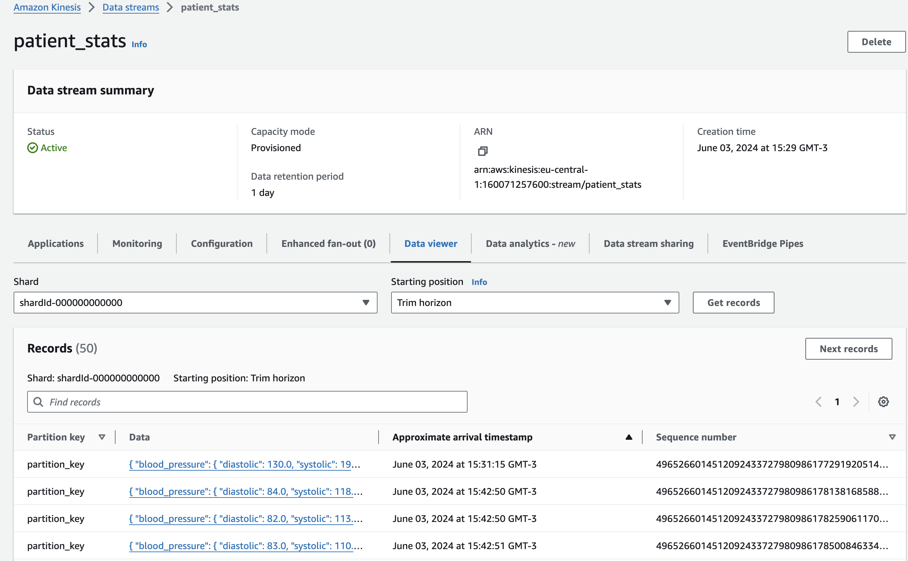
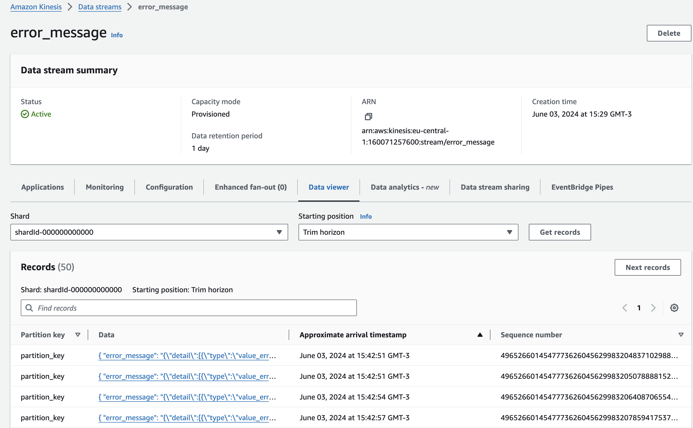
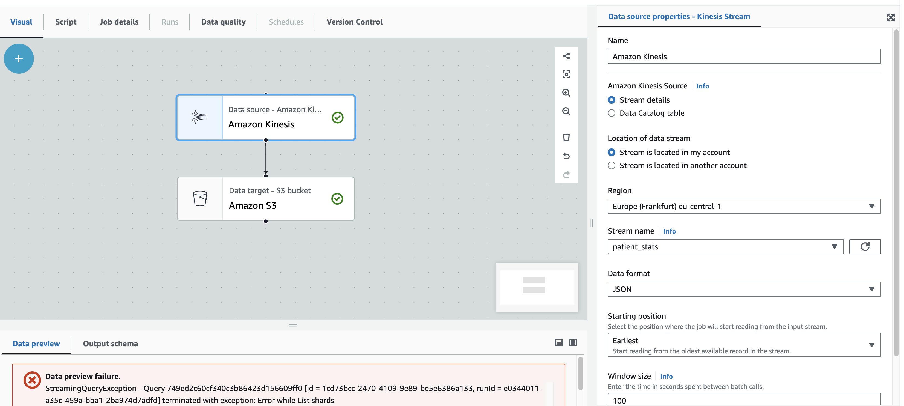
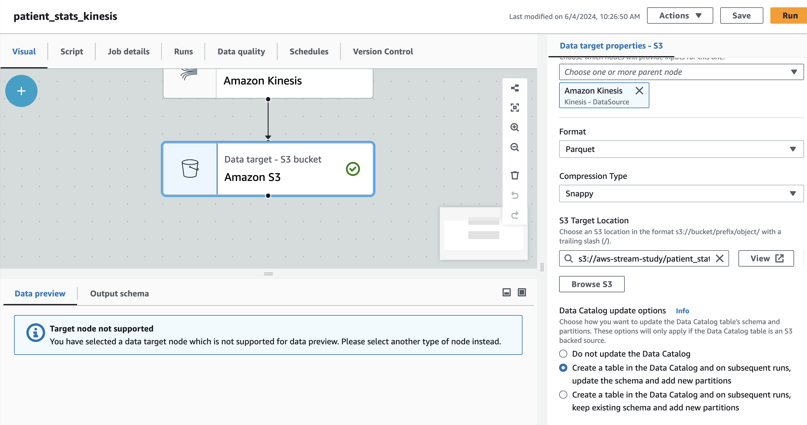
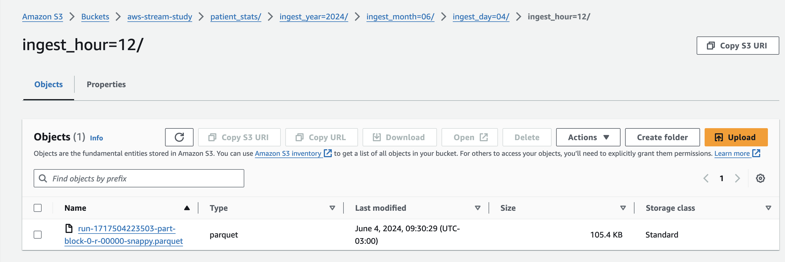
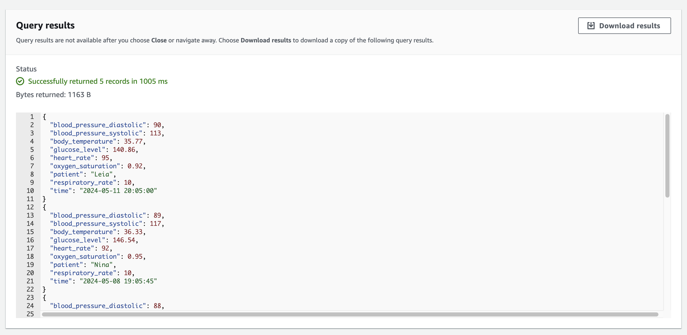

# AWS Stream Study
This repository contains an AWS study regarding streaming services. We're going to use FastAPI to provide the endpoints to send data to 2 different kinesis streams. 

The generator will create fake data simulating a sensor that collects health data from the patient - body temperature, glucose level, blood pressure and others (you can check the full schema using swagger).

There are two situations - first when data is validated by pydantic and goes directly to the `patient_stats` stream and second when data is not validated by pydantic (e.g.: when a blood pressure value is passed and the diastolic pressure is greater than systolic) and is sent to an error collection called `error_message`.

To consume the data from kinesis we are going to setup a AWS Glue ETL Streaming saving the data as parquet in a S3 bucket and to finally query the data we can use Athena.

## Creating the streaming resources
Run the following command in your authenticated console to spawn 2 kinesis streams. Change any parameters if needed. After that, check if the streams were created in the console.

```
aws kinesis create-stream \
    --stream-name patient_stats \
    --shard-count 1 \
    --region eu-central-1

aws kinesis create-stream \
    --stream-name error_message \
    --shard-count 1 \
    --region eu-central-1

aws s3api create-bucket \
    --bucket aws-stream-study \
    --region eu-central-1 \
    --create-bucket-configuration LocationConstraint=eu-central-1
```
(adicionar imagem das streams criadas no console)

## Populating the `.env` file

Create and populate an `.env` file in this root directory adding the credentials values for AWS. Use or rename the `.env-template` as reference.

```
AWS_ACCESS_KEY_ID="[INSERT_HERE]"
AWS_SECRET_ACCESS_KEY="[INSERT_HERE]"
AWS_SESSION_TOKEN="[INSERT_HERE]"
AWS_REGION="eu-central-1"
```

## Run the docker-compose

Pre-step: https://docs.docker.com/compose/install/

Run the docker-compose to start the API and the generator using the following command:
```
make run-services
```

The generator will add data for 10 minutes, after that it will stop but the API will still be available. You can access it using [http://localhost:8000/docs](http://localhost:8000/docs)

## Check the data being generated using the AWS Console

Access the streaming data in Amazon Kinesis Data Viewer:





## Create a Glue Data Consumer

### Create a Glue Data Catalog Database and Table

Using AWS Console, go to Data Catalog and Add a new Database. Name it correctly and create tables called `patient_stats` and `error_message` classified as JSON. To define the tables schema, use the following JSONs.

- Schema used for `patient_stats`:
```
[
    {
      "Name": "patient",
      "Type": "string"
    },
    {
      "Name": "time",
      "Type": "date"
    },
    {
      "Name": "glucose_level",
      "Type": "double"
    },
    {
      "Name": "oxygen_saturation",
      "Type": "double"
    },
    {
      "Name": "body_temperature",
      "Type": "double"
    },
    {
      "Name": "respiratory_rate",
      "Type": "double"
    },
    {
      "Name": "heart_rate",
      "Type": "double"
    },
    {
      "Name": "blood_pressure_systolic",
      "Type": "double"
    },
    {
      "Name": "blood_pressure_diastolic",
      "Type": "double"
    }
]
```

- Schema used for `error_message`:
```
[
    {
      "Name": "status_code",
      "Type": "integer"
    },
    {
      "Name": "payload",
      "Type": "string"
    },
    {
      "Name": "error_message",
      "Type": "string"
    }
]
```

### Create folder in S3 bucket

Add folders to the previously created S3 Bucket - They can be patient_stats and error_message for example.

### Create an AWS Glue Job to send data to S3
Create two different jobs - one for `error_message` and another for `patient_stats`. They should populate a S3 path location and you can check the Glue Job to create a table on the data catalog for the data saved in .parquet.





### Check the data in S3 or Query it with Athena

Check the S3 bucket to find data and preview it. You can also query data with Athena.





## Conclusions

This project allows to get in touch with some streaming/event architecture using a serverless approach.

It would be also interesting to send data to a real-time OLAP Database such as Apache Druid to query data instead of Athena. Using Firehose also showed as an interesting solution. Another important topic is that sending data to s3 can add unwanted latency but it can work fine for a lot of situations where you just want to process the messages and create for example a first layer of a datalake structure (raw/staging).